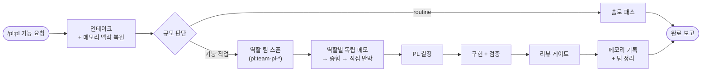
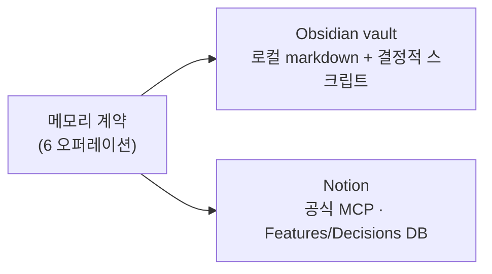

<div align="center">

# pl

**`/pl:pl` 한 번으로 역할 에이전트 팀이 토론하고, 구현하고, 검증하고, 결정을 기억합니다**


</div>

---

PL/테크리드 오케스트레이션 플러그인입니다. 기능 요청을 받으면 리드(PL)가 역할 에이전트 팀을 구성해 구조화된 토론을 거쳐 결정하고, 구현·검증 후 결과와 결정을 **선택한 메모리 백엔드(Obsidian vault / Notion)** 에 기록합니다. 다음 작업에서 그 기억이 자동으로 복원됩니다.

## 워크플로우



기록은 백엔드 중립 계약(맥락 복원 → 작업공간 확인 → feature 노트 → 원장 갱신 → 결정 기록 → 무결성 점검)으로 동작하고, 실제 저장은 어댑터가 담당합니다:



## 설치

> **전제조건**: macOS/Linux + `python3` 3.10 이상 (Obsidian 백엔드 헬퍼가 Unix 전용 잠금 `fcntl`을 사용합니다. Windows 미지원). 마켓플레이스 접근 조건은 [루트 README](../../README.md#설치) 참조.

```
/plugin marketplace add zz1996zz/claude-code-plugins
/plugin install pl@zz1996zz
```

## 사용

```
/pl:pl <기능 요청>
```

예: `/pl:pl 주문 취소 API에 부분 취소 지원 추가`

- routine한 요청(오탈자 점검 등)은 솔로 패스로 가볍게 처리됩니다.
- 기능 작업이면 역할 팀 구성 → 토론 → 결정 → 구현 → 검증 → 메모리 기록까지 진행됩니다.
- work 네임스페이스는 **canonical 레포명**(origin remote 기준)으로 정해집니다 — worktree나 워크스페이스 디렉토리 이름에 영향받지 않습니다. 특정 업무로 기록하려면 요청에 업무명을 명시하세요.

## 메모리 백엔드 (온보딩 1회)

메모리가 필요한 **최초의 기능 작업**에서 온보딩이 시작됩니다 (routine 요청은 메모리를 쓰지 않으므로 온보딩이 나오지 않습니다).

| 선택지 | 준비물 | 온보딩에서 할 일 |
|---|---|---|
| **Obsidian vault** (로컬 markdown) | 없음 (Obsidian 앱 불필요) | 저장 경로 1개 답하기 |
| **Notion** (공식 MCP, source of truth) | Notion 계정 | `/mcp`에서 Notion OAuth 1회 + 메모리 root 페이지 URL 붙여넣기 |

- Notion 선택 시 root 페이지 아래 **Features/Decisions 데이터베이스**와 **Works 페이지**가 자동 생성됩니다.
- 백엔드 변경: `${CLAUDE_PLUGIN_DATA}/config.json` 삭제 후 재온보딩 (기존 데이터 이관은 미지원).
- Obsidian만 쓸 경우 동봉된 Notion MCP 서버는 사용되지 않으므로 `/mcp`에서 `notion` 서버를 비활성화해도 됩니다.
- Notion 쓰기 실패 시 기록은 `${CLAUDE_PLUGIN_DATA}/pending/`에 보존됐다가 다음 실행에서 업서트로 재반영됩니다 — 조용한 유실이 없습니다.

## 업데이트

```
/plugin marketplace update zz1996zz
/plugin update pl@zz1996zz
```

업데이트 시 사용자 데이터(`config.json`·`pending/`)는 보존됩니다. **`uninstall`은 데이터를 삭제하므로** 갱신 용도로 쓰지 마세요 ([루트 README](../../README.md#업데이트) 참조).

## 개발

- 시스템 변경 후 테스트 3종 실행: `skills/team-pl-orchestrator/scripts/`의 `test_pl_config.py` · `test_memory_note.py` · `test_pl_user_config.py`
- 리드 머신 전용 검사를 건너뛰려면: `PL_SKIP_MACHINE_TESTS=1`
